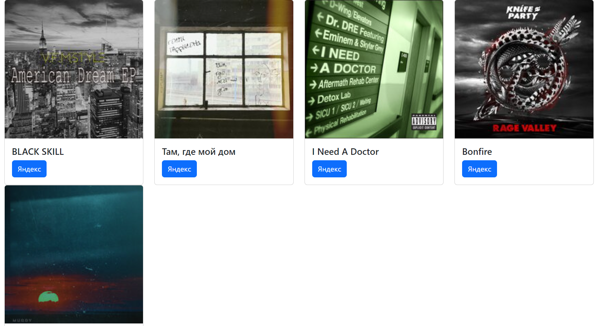

<h1 align="center">Yandex Music Share</h1>
<h4 align="center"><b>Powered specifically for Ekaterina Vi.</b></h4>

<h3>Формирует страницу с карточками музыки для дальнейшего распространения</h3>

В <i>links.txt</i> закидываете ссылки и запускаете <i>paeserMain.py</i>.  
На выходе получаете <i>index.html</i> который можете скинуть другу :)

Зависимости:
<ul>
<li>Python >= 3.7</li>
<li>beautifulsoup4</li>
<li>requests</li>
</ul>

Write links in <i>links.txt</i> and start <i>paeserMain.py</i>.  
Returned <i>index.html</i> for share in your friend's :)

Required:
<ul>
<li>Python >= 3.7</li>
<li>beautifulsoup4</li>
<li>requests</li>
</ul>